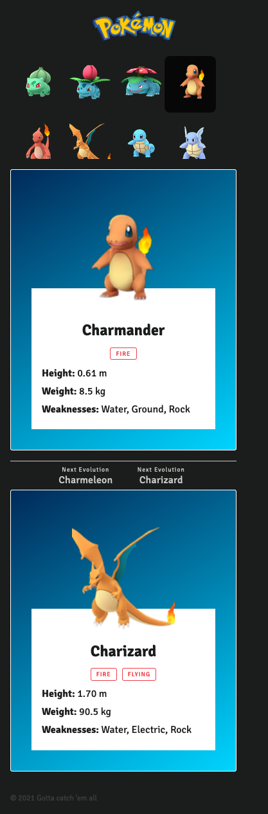

## Stack Tecnológico

* React
* NextJS
* Apollo
* GraphQL
* Typescript
* Styled Components

## Descripción

El proyecto es desarrollado como una SPA en Typescript en la que incluye lo siguiente:

* Cabecera con el logo de Pokemon
* Un listado
* Una card del Pokemon seleccionado
* Una card de su evolución (si la tiene)
* Footer con el copyright

Los datos de todos los Pokemons están dentro del siguiente archivo, y se consumen utilizando GraphQL:

```
.
└── services
    └── db.json
```

El API está implementado utilizando el [API de Nextjs](https://nextjs.org/docs/api-routes/introduction), con las queries necesarias para traer todos los Pokemons y el Pokemon seleccionado, dentro de la siguiente carpeta se encuentran los schemas de GraphQL, los resolvers, que son los que se comunican con el API, y las rutas del API:

```
.
└── pages
    └── api
        ├── pokemons
        ├── resolvers
        └── schemas
```

Estos son los diseños esperados.

| Móvil | Tablet | Desktop |
|---|---|---|
|  |  |  |

Los settings y gráficos necesarios de la UI se encuentran en la carpeta:

```
.
└── ui
    ├── svg
    │   └── *
    └── settings.ts
```

El funcionamiento es el siguiente:


